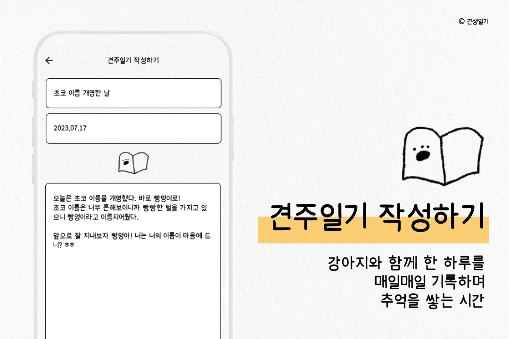
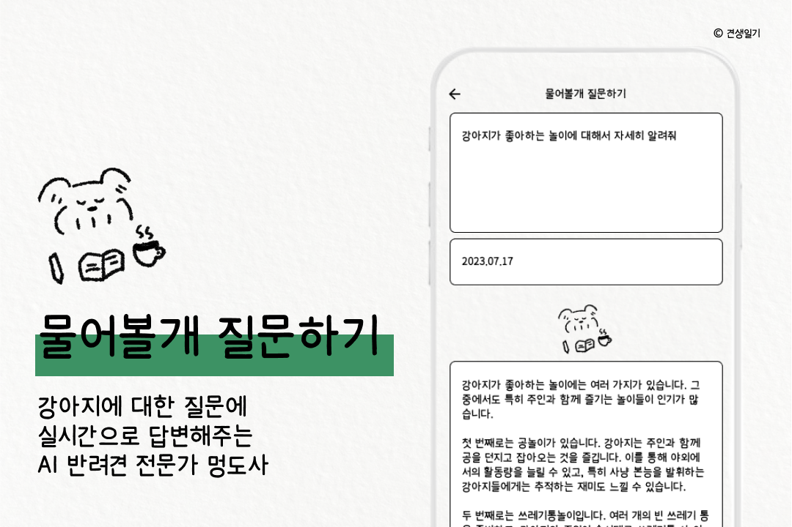
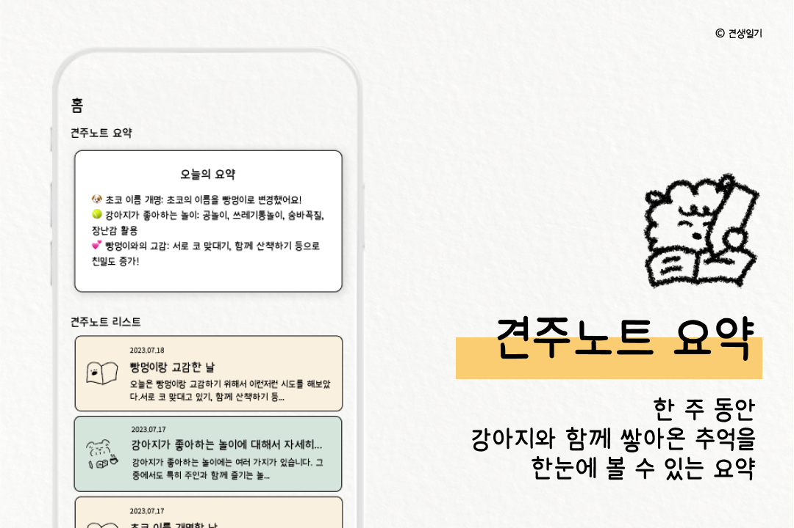
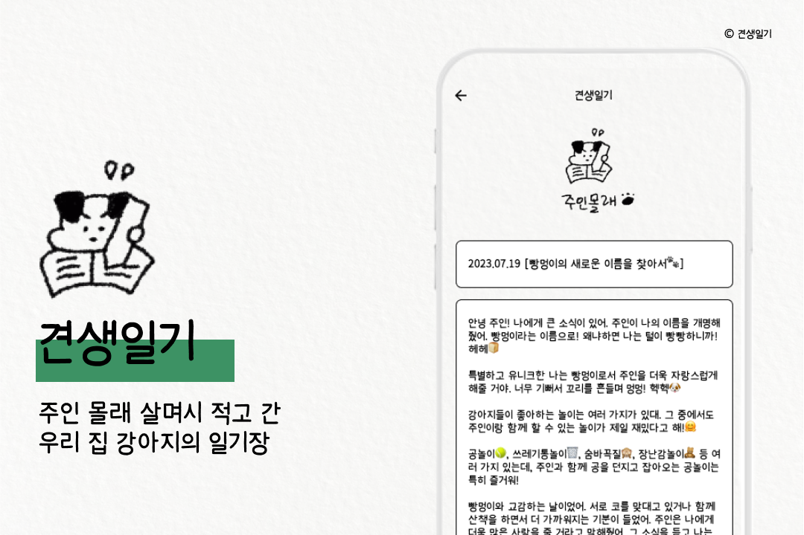

<h1 align="center">🐶 우리 강아지와 함께 쓰는 교환일기, 견생일기!</h1>

<h4 align="center">강아지의 행동을 보면서 강아지의 기분과 생각을 알 수 있다면 얼마나 좋을까요?</h3>
<h4 align="center">그리고 강아지와 내가 교환일기처럼, 서로 일기장을 쓰며 교감한다면요?</h3>
<h4 align="center">생각만 해도 귀엽고 신나지 않나요? 😆</h3>
<h4 align="center">견생일기에서 강아지에 대한 추억을 남기고, 강아지의 귀여운 일기장도 경험해보세요!</h3>

# 📖 견주일기 작성하기

<h4 align="center">오늘 하루, 강아지와 함께한 하루를 기록해보세요!</h3>
<h4 align="center">하루하루 기록이 쌓이다보면</h3>
<h4 align="center">함께했던 시간들을 회상할 수 있어요! 🐶</h3>

# 🔮 물어볼개 질문하기

<h4 align="center">우리 강아지에 대해 궁금한 점이 있으셨나요?</h3>
<h4 align="center">AI 반려견 전문가 멍도사에게 물어보세요! 🐕</h3>
<h4 align="center">친절하게 답변도 해주고 잊지 않도록 기록도 해준답니다.</h3>

# 📝 견주노트 요약

<h4 align="center">이번주 동안 우리 집 강아지의 기록을 얼마나 많이 하셨나요?</h3>
<h4 align="center">우리가 한 주 동안 있었던 일을 매일 자동으로 요약해줄게요! 🐩</h3>

# 💌 우리 집 강아지가 몰래 남겨놓고 가는 견생일기

<h4 align="center">나와 보낸 일상을 강아지는 어떻게 생각하고 있을까요?</h3>
<h4 align="center">견주일기가 쌓이면 강아지가 몰래 일기를 쓰고 간답니다!</h3>
<h4 align="center">우리 집 강아지가 어떤 생각을 하는지 확인해보세요!</h3>

[인스타그램](https://www.instagram.com/mydogdiary_official/)  
[이용약관](https://sites.google.com/view/dogdiarys/홈/이용약관?authuser=4)  
[개인정보처리방침](https://sites.google.com/view/dogdiarys/홈/개인정보처리방침?authuser=4)  

  
  
  
Copyright ©견생일기Corp. All rights reserved.
